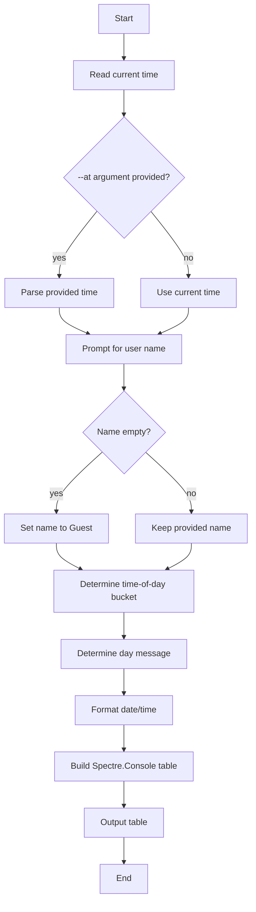

# backend_welcome_message

## Description

This project will be a simple CLI program that gives users a welcome message customized to change based on the current time and date.

## Flowchart (overview)



## Dev environment (Nix flake)

- Prerequisite: Nix with flakes enabled.
- Enter the shell:

```sh
nix develop
```

- Run the app:

```sh
dotnet run
```

- Or run via flake app:

```sh
nix run
```

## Without Nix

- Install .NET SDK 8.
- Run:

```sh
dotnet run
```

## Pseudocode

START
    now = current date/time
    SHOW "What is your name?"(allow empty)
    INPUT name
    IF name is null/empty/whitespace THEN
        name = "Guest"
    Else
        name = trim(name)
    ENDIF
END

FUNCTION BuildGreeting(now, name)
    formatted = format(now, "dddd dd.MM.yyyy HH:mm", variant)
    IF now.Hour between 5 and 11 THEN timeOfDay = "Good morning"
        ELSEIF now.Hour between 12 and 17 THEN timeOfDay = "Good afternoon"
        ELSEIF now.Hour between 18 and 21 THEN timeofDay = "Good evening"
        ELSE timeOfDay = "Good Night"
    ENDIF
    IF now.DayOfWeek is Saturday or Sunday THEN
        dayType = "Enjoy your {day}!"
    ELSE
        dayType = "Have a great {day}!"
    ENDIF
    CREATETABLE
        ADD column "Part"
        ADD column "Value"
        ADD row ("Greeting", timeOfDay+","+name+"!")
        ADD row ("Date/Time", formatted)
        ADD row ("Day Type", dayType)
    RETURN table
END FUNCTION
